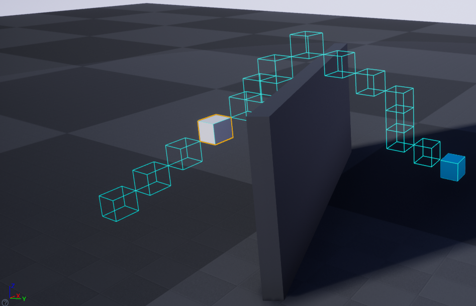
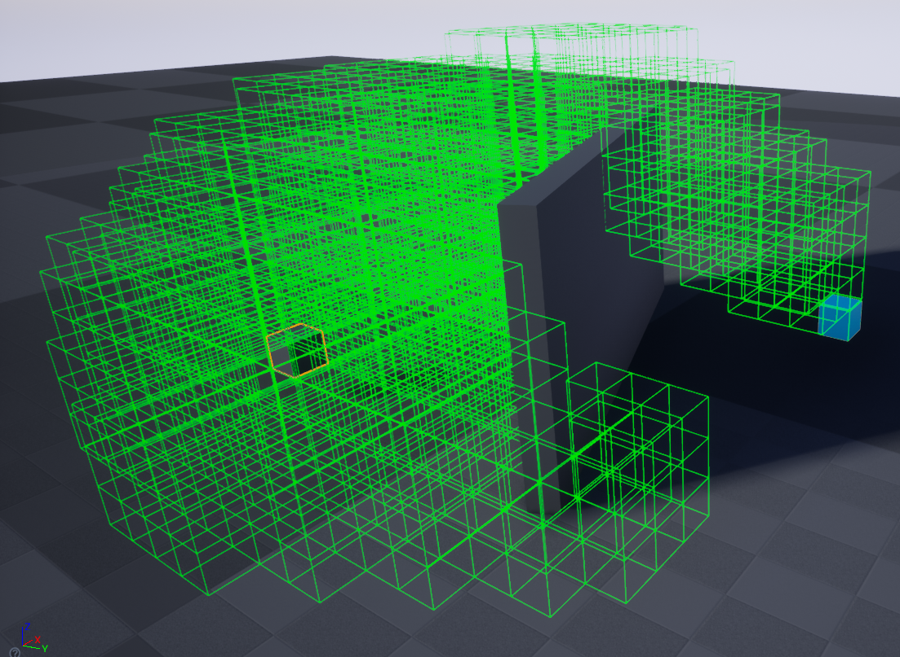
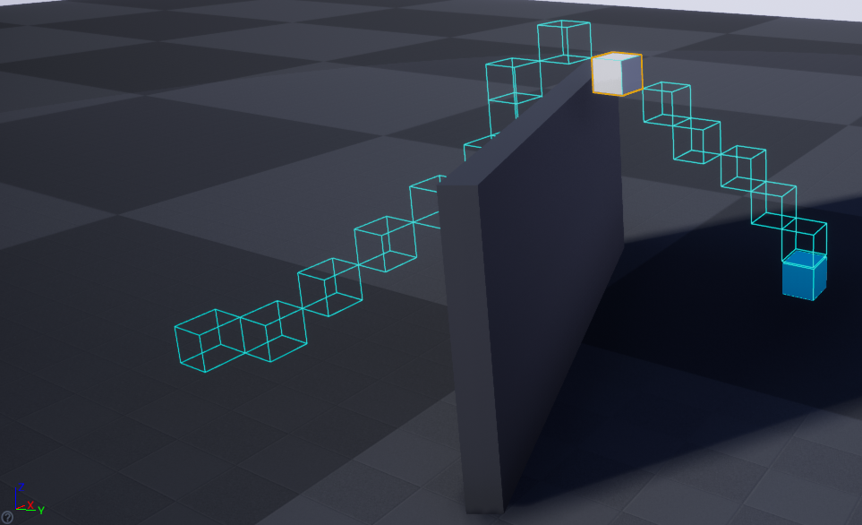
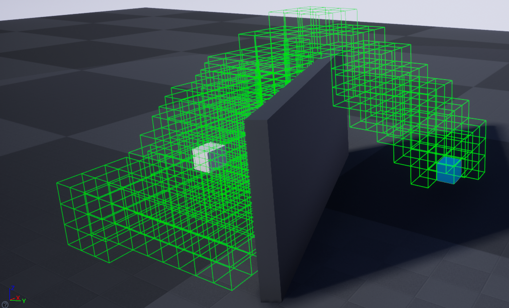
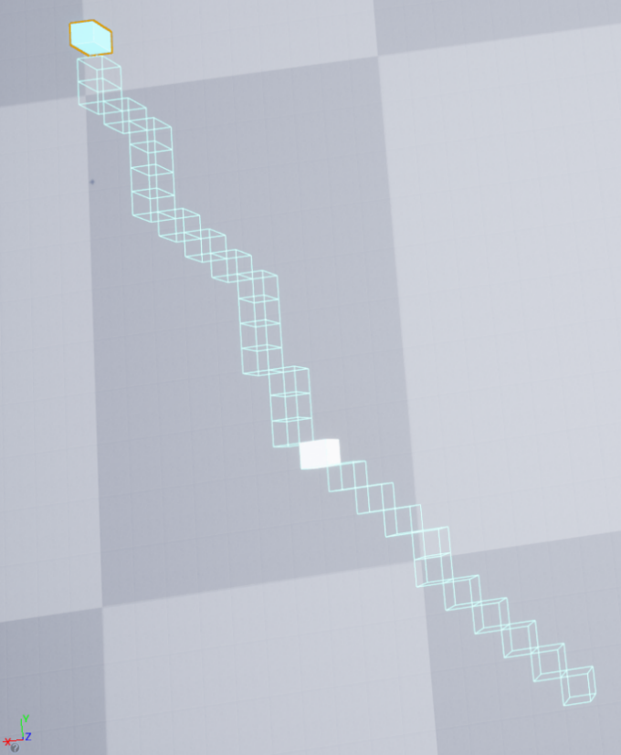
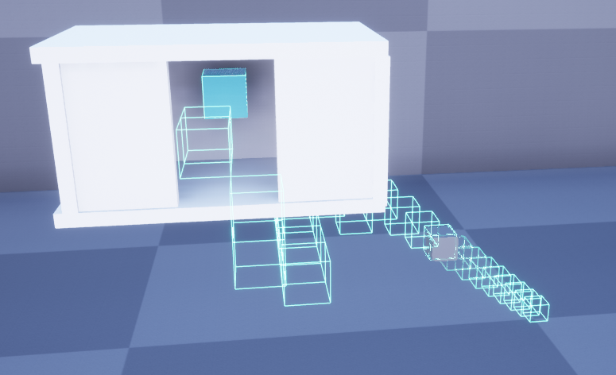

## A* 3D Pathfinding Algorithm

##EDIT: THis codebase is absolute pants, dont ever use this... :D

There are a few issues with the implementation
* Using the Unreal Engine's collision system to assign node's connected neighbouring nodes is inneficient.  
* A conisderable amount of overlapping nodes are spawned because the collision/overlap system doesn't detect overlapping when nodes are exactly in the same position.  
* The current implementation doesn't include runtime replanning, so obstructed nodes during running, an alternative path isnt produced.
* An improvement to the pathfinding in 3D algorithm would be to use "3D Field D*" algorithm. (Joseph Carsten, D. F. A. S., 2006. 3D Field D*: Improved Path Planning and Replanning in Three Dimensions. Beijing, IEEE.)
https://www-robotics.jpl.nasa.gov/publications/Joseph_Carsten/fdstar3d.pdf

## Where admissability = 1

## Where admissability = 3

## Where admissability = 1

## Where admissability = 5

## Where admissability = 3

## Usage (Windows)
* Run the AStarAlgorithm.uproject, opening UE4
* Select a pre-made level
* Run the Level
