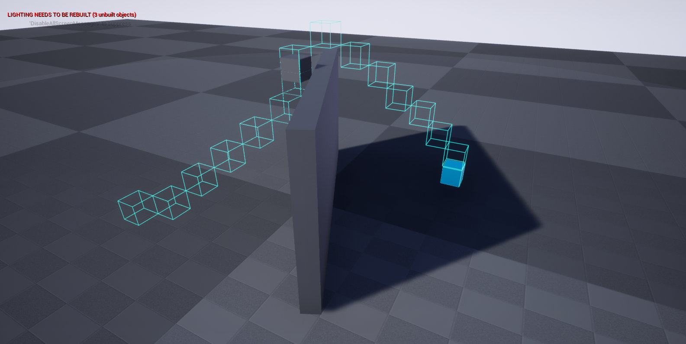
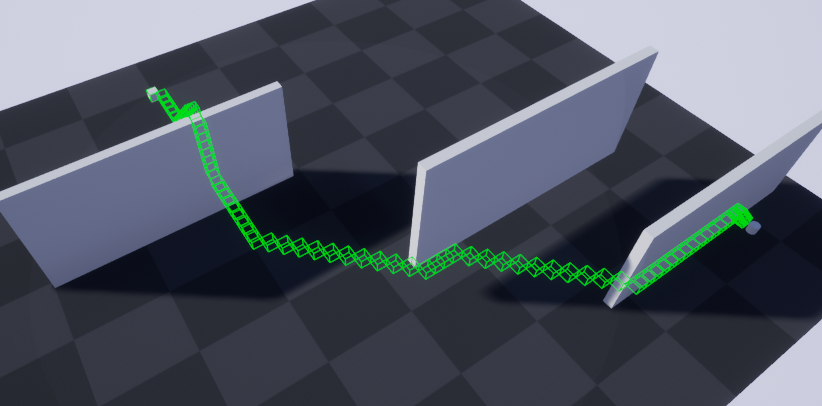

## A* 3D Pathfinding Algorithm

There are a few issues with the implementation
* Using the unreal engine collision system to assign node's connected neighbouring nodes is inneficient.  
* A conisderable amount of overlapping nodes are spawned because the collision/overlap system doesn't detect overlapping when nodes are exactly in the same position.  

## Usage (Windows)
* Run the AStarAlgorithm.uproject, opening UE4
* Select a pre-made level
* Run the Level
